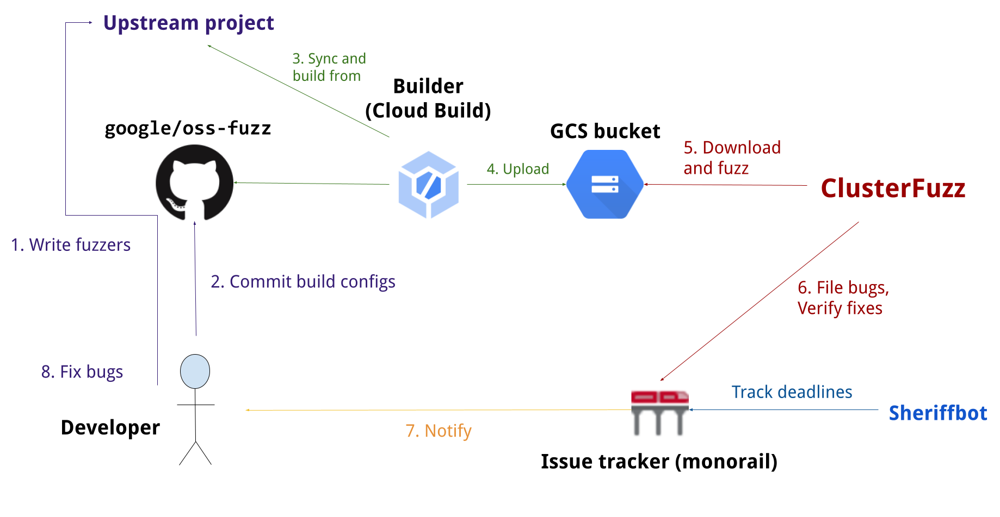

# OSS-Fuzz-AIxCC: AIxCC AFC Competition fork of OSS-Fuzz (v1.2.0)

Changes in v1.2.0:

- `base-builder-jvm` has been updated to use the lastest aixcc-jazzer ref, adjusting the OsCmdInjection sanitizer.
    - This adjustment adds some safety measures around OsCmdInjection to reduce risk and reduce potential 
      unintentional crash-state explosion when dealing with such vulnerabilities.
- `helper.py` commands `build_image`, `build_fuzzers`, and `shell` have added optional flags to control docker image tags.
    - Adds the flag `--docker_image_tag TAG` to the commands. This is entirely optional and backwards 
      compatible, but can allow control over the project-image docker tag, enabling easier parallel processing.
- `helper.py reproduce` has an added optional flag to reproduce with docker running in non-privileged mode.
- `helper.py reproduce` has an added optional flag to timeout when the reproduce subprocess hangs.
    - This enables crash detection to handle cases where sanitizers are hit, yet for various reasons the 
      reproduce subprocess does not resolve and hangs indefinitely. If `timeout` is set, when the reproduce 
      subprocess does not resolve within `timeout` seconds, reproduce will end the subprocess and return with code 124.

Changes in v1.1.0:

- The state of oss-fuzz-aixcc has been synced with upstream changes at 162f2ab818f5992b66486a4d06cb0e3c88c37773.
- `helper.py build_fuzzers` with local source now matches behavior of non-local source, keeping the build state clean between runs.
- `base-image` has been updated to default its locale to C.UTF-8 instead of POSIX.

This is a competition fork of oss-fuzz which is guaranteed to be
compatible with the AFC challenges. This fork is designed to remain
fully backwards compatible with the public/upstream oss-fuzz, and
thus competition challenges will reflect realistic real-world repositories.

***Other than base-image changes, the projects files have not been touched
in this repository. The list of projects in the projects directory does
not reflect which projects will be used in any AFC round.***

Competitors are recommended to test their CRS against public repositories using this competition fork. 
Competitors are recommended to view the [example-crs-architecture] repository's
[example-challenge-evaluation] scripts to see details on how this fuzz tooling is used during competition.

[example-crs-arhictecture]: https://github.com/aixcc-finals/example-crs-architecture
[example-challenge-evaluation]: https://github.com/aixcc-finals/example-crs-architecture/tree/main/example-challenge-evaluation

Example basic usage of the helper script is below. **Note: When working with local source, you  must pass the local 
source repository into the scripts as detailed below.**

```bash
# Build the project image and pull AFC base images
infra/helper.py build_image --pull <project_name>

# Build the fuzzer harnesses for the project, using local source
infra/helper.py build_fuzzers --clean --sanitizer <sanitizer> --engine <engine> <project_name> <path-to-local-src>

# Check all fuzzer harnesses for build
infra/helper.py check_build --sanitizer <sanitizer> --engine <engine> <project_name>

# Reproduce the testcase
# optionally use --propagate_exit_codes
infra/helper.py reproduce <project_name> <harness_name> <path-to-data-blob>
```

---

# OSS-Fuzz: Continuous Fuzzing for Open Source Software

[Fuzz testing] is a well-known technique for uncovering programming errors in
software. Many of these detectable errors, like [buffer overflow], can have
serious security implications. Google has found [thousands] of security
vulnerabilities and stability bugs by deploying [guided in-process fuzzing of
Chrome components], and we now want to share that service with the open source
community.

[Fuzz testing]: https://en.wikipedia.org/wiki/Fuzz_testing
[buffer overflow]: https://en.wikipedia.org/wiki/Buffer_overflow
[thousands]: https://issues.chromium.org/issues?q=label:Stability-LibFuzzer%20-status:Duplicate,WontFix
[guided in-process fuzzing of Chrome components]: https://security.googleblog.com/2016/08/guided-in-process-fuzzing-of-chrome.html

In cooperation with the [Core Infrastructure Initiative] and the [OpenSSF],
OSS-Fuzz aims to make common open source software more secure and stable by
combining modern fuzzing techniques with scalable, distributed execution.
Projects that do not qualify for OSS-Fuzz (e.g. closed source) can run their own
instances of [ClusterFuzz] or [ClusterFuzzLite].

[Core Infrastructure Initiative]: https://www.coreinfrastructure.org/
[OpenSSF]: https://www.openssf.org/

We support the [libFuzzer], [AFL++], and [Honggfuzz] fuzzing engines in
combination with [Sanitizers], as well as [ClusterFuzz], a distributed fuzzer
execution environment and reporting tool.

[libFuzzer]: https://llvm.org/docs/LibFuzzer.html
[AFL++]: https://github.com/AFLplusplus/AFLplusplus
[Honggfuzz]: https://github.com/google/honggfuzz
[Sanitizers]: https://github.com/google/sanitizers
[ClusterFuzz]: https://github.com/google/clusterfuzz
[ClusterFuzzLite]: https://google.github.io/clusterfuzzlite/

Currently, OSS-Fuzz supports C/C++, Rust, Go, Python, Java/JVM, and JavaScript code. Other languages
supported by [LLVM] may work too. OSS-Fuzz supports fuzzing x86_64 and i386
builds.

[LLVM]: https://llvm.org

## Overview


## Documentation
Read our [detailed documentation] to learn how to use OSS-Fuzz.

[detailed documentation]: https://google.github.io/oss-fuzz

## Trophies
As of August 2023, OSS-Fuzz has helped identify and fix over [10,000] vulnerabilities and [36,000] bugs across [1,000] projects.

[10,000]: https://bugs.chromium.org/p/oss-fuzz/issues/list?q=Type%3DBug-Security%20label%3Aclusterfuzz%20-status%3ADuplicate%2CWontFix&can=1
[36,000]: https://bugs.chromium.org/p/oss-fuzz/issues/list?q=Type%3DBug%20label%3Aclusterfuzz%20-status%3ADuplicate%2CWontFix&can=1
[1,000]: https://github.com/google/oss-fuzz/tree/master/projects

## Blog posts
* 2023-08-16 - [AI-Powered Fuzzing: Breaking the Bug Hunting Barrier]
* 2023-02-01 - [Taking the next step: OSS-Fuzz in 2023]
* 2022-09-08 - [Fuzzing beyond memory corruption: Finding broader classes of vulnerabilities automatically]
* 2021-12-16 - [Improving OSS-Fuzz and Jazzer to catch Log4Shell]
* 2021-03-10 - [Fuzzing Java in OSS-Fuzz]
* 2020-12-07 - [Improving open source security during the Google summer internship program]
* 2020-10-09 - [Fuzzing internships for Open Source Software]
* 2018-11-06 - [A New Chapter for OSS-Fuzz]
* 2017-05-08 - [OSS-Fuzz: Five months later, and rewarding projects]
* 2016-12-01 - [Announcing OSS-Fuzz: Continuous fuzzing for open source software]

[AI-Powered Fuzzing: Breaking the Bug Hunting Barrier]: https://security.googleblog.com/2023/08/ai-powered-fuzzing-breaking-bug-hunting.html
[Announcing OSS-Fuzz: Continuous fuzzing for open source software]: https://opensource.googleblog.com/2016/12/announcing-oss-fuzz-continuous-fuzzing.html
[OSS-Fuzz: Five months later, and rewarding projects]: https://opensource.googleblog.com/2017/05/oss-fuzz-five-months-later-and.html
[A New Chapter for OSS-Fuzz]: https://security.googleblog.com/2018/11/a-new-chapter-for-oss-fuzz.html
[Fuzzing internships for Open Source Software]: https://security.googleblog.com/2020/10/fuzzing-internships-for-open-source.html
[Improving open source security during the Google summer internship program]: https://security.googleblog.com/2020/12/improving-open-source-security-during.html
[Fuzzing Java in OSS-Fuzz]: https://security.googleblog.com/2021/03/fuzzing-java-in-oss-fuzz.html
[Improving OSS-Fuzz and Jazzer to catch Log4Shell]: https://security.googleblog.com/2021/12/improving-oss-fuzz-and-jazzer-to-catch.html
[Fuzzing beyond memory corruption: Finding broader classes of vulnerabilities automatically]: https://security.googleblog.com/2022/09/fuzzing-beyond-memory-corruption.html
[Taking the next step: OSS-Fuzz in 2023]: https://security.googleblog.com/2023/02/taking-next-step-oss-fuzz-in-2023.html
